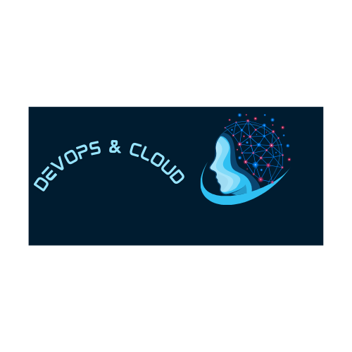

<header style="display: flex; align-items: center; justify-content: space-between;">
  
  

    <h1>Nyanga P - DevOps and Cloud Engineer</h1>
    

      
    

  

</header>

<section id="objective" class="home-section">
  <h2>Objective</h2>
  
As a DevOps and Cloud Engineer with over 7 years of experience, I am dedicated to leveraging my expertise in cloud solutions, automation, and CI/CD processes to drive efficiency and innovation in technology environments.

</section>

<section id="skills" class="home-section">
  <h2>Skills</h2>
  <table>
    <thead>
      <tr>
        <th>Skill</th>
        <th>Associated Project</th>
      </tr>
    </thead>
    <tbody>
      <tr>
        <td>CI/CD Automation</td>
        <td><a href="https://github.com/m-pasima/CI-CD-Pipeline-Project">CI/CD Pipeline Project</a></td>
      </tr>
      <tr>
        <td>Infrastructure as Code (IaC)</td>
        <td><a href="https://github.com/m-pasima/Aws-terraform-multi-tier-application.git">AWS 3 Tier architecture with ECS Terraform Project</a></td>
      </tr>
      <tr>
        <td>Security and Compliance</td>
        <td><a href="https://github.com/m-pasima/Security-Implementation-Project.git">Security Implementation Project</a></td>
      </tr>
      <tr>
        <td>Cloud Architecture and Deployment</td>
        <td><a href="https://github.com/m-pasima/Cloud-Deployment-Project.git">Cloud Deployment Project</a></td>
      </tr>
      <tr>
        <td>Containerization and Orchestration</td>
        <td><a href="https://github.com/m-pasima/Kubernetes-Deployment-Project.git">Kubernetes Deployment Project</a></td>
      </tr>
      <tr>
        <td>Monitoring and Logging</td>
        <td><a href="https://github.com/m-pasima/Monitoring-and-Logging-Project.git">Monitoring and Logging Project</a></td>
      </tr>
    </tbody>
  </table>
</section>

<section id="tools" class="home-section">
  <h2>Tools</h2>
  <h3>CI/CD and Automation</h3>
  

    
    
    
    
    
    
    
    
  

  <h3>Cloud Platforms</h3>
  

    
    
  

  <h3>Containerization and Orchestration</h3>
  

    
    
    
  

  <h3>Monitoring and Logging</h3>
  

    
    
    
  

</section>

<section id="experience" class="home-section">
  <h2>Professional Experience</h2>
  <h3>Senior DevOps Engineer, Atomix LTD</h3>
  
<strong>March 2023 – Present | Suffolk, United Kingdom</strong>

  <ul>
    <li>Planned and architected infrastructure deployment using Draw.io, ensuring compliance with security and data regulations.</li>
    <li>Set up OpenVPN for secure user access, including the creation of users and groups, and assigned permissions based on the principle of least privilege.</li>
    <li>Established self-hosted CI/CD pipelines using GitHub Actions for automation processes.</li>
    <li>Deployed services in Google Cloud Platform (GCP) using Terraform and Terragrunt, focusing on Infrastructure as Code (IaC). This involved setting up various services such as Virtual Private Cloud (VPC) and its components, private Google Kubernetes Engine (GKE) clusters, Artifact Registry, Identity and Access Management (IAM), service accounts, and Secrets Manager.</li>
    <li>Utilized Terraform to create GCP groups, add team members, and assign relevant privileges.</li>
    <li>Configured and developed Helm charts from scratch for deploying tools like Argo CD, Redis, and PostgreSQL and production applications.</li>
    <li>Employed Helm charts for deploying monitoring tools such as Prometheus and Grafana, and for creating Grafana dashboards.</li>
    <li>Modified and enhanced Bash scripts and Python scripts for automation purposes.</li>
    <li>Deployed applications into private GKE clusters using Helm charts and performed troubleshooting of containerized applications in Kubernetes.</li>
    <li>Configured and managed the rotation of secrets in GCP Secrets, setup Cloudflare and implemented SSL certificates in private clusters using Terraform.</li>
    <li>Set up monitoring metrics in the GCP environment.</li>
    <li>Configured and set up disaster recovery solutions in the production environment.</li>
    <li>Planned projects, broke down tasks, and created Jira tasks.</li>
    <li>Documented projects using Confluence.</li>
  </ul>

  <h3>DevOps Engineer, BP</h3>
  
<strong>April 2020 – March 2023 | London, United Kingdom</strong>

  <ul>
    <li>Engineered intricate CI/CD pipelines, utilizing Jenkins and GitHub Actions, allowing faster and reliable deployments.</li>
    <li>Led the transition from a monolithic architecture to a microservices-based setup, from Tomcat to EKS substantially improving system reliability and scalability.</li>
    <li>Implemented a robust monitoring solution incorporating elevated security protocols within Linux-based systems, Docker containers, and Kubernetes clusters in both AWS EKS and GCP GKE.</li>
    <li>Created and configured OpenVPN, creating user groups for secure and role-based access. Used VPNs for secure CI/CD deployments.</li>
    <li>Wrote Terraform and Terragrunt scripts for automated infrastructure provisioning on AWS.</li>
    <li>Utilized Ansible with dynamic inventory for server configuration.</li>
    <li>Involved in the recruitment process, training new team members, and introducing them to our technology stack.</li>
    <li>Regularly attended job-related seminars and training sessions to keep up-to-date with the latest industry trends and technologies.</li>
    <li>Configured and set up IAM roles for contractors.</li>
    <li>Configured and set up various AWS services, including Application Load Balancer (ALB), Virtual Private Cloud (VPC), subnets, CloudFront, Relational Database Service (RDS), DynamoDB, Route 53, Web Application Firewall (WAF), Simple Storage Service (S3), Elastic File System (EFS), Identity and Access Management (IAM), Secrets Manager, Certificate Manager, CloudWatch, and Auto Scaling groups, among others.</li>
  </ul>

  <h3>Build and Release Engineer, Sky</h3>
  
<strong>November 2017 – March 2020 | London, United Kingdom</strong>

  <ul>
    <li>Developed an automated build process integrating Jenkins, Git, Maven, SonarQube, Nexus, Docker, Ansible, and Terraform.</li>
    <li>Collaborated across teams for web software build, release, and deployment projects.</li>
    <li>Created Jenkinsfile for automated deployments.</li>
    <li>Configured and managed Jenkins server for CI/CD pipelines.</li>
    <li>Automated the software development process and monitored infrastructure performance using New Relic.</li>
    <li>Modified Helm charts for deployments.</li>
    <li>Ensured compliance with the company’s DevOps standards.</li>
    <li>Configured NACL, ACL, and security groups on AWS for access control.</li>
    <li>Supported and maintained hardware and software infrastructure on Linux-based systems.</li>
    <li>Performed manual production deployments and shadowed senior engineers.</li>
    <li>Participated in project planning and task allocation.</li>
  </ul>

  <h3>Junior AWS Cloud and Linux Engineer, Diebold Nixdorf Software Partner B.V.</h3>
  
<strong>June 2016 – September 2017 | Bromley, United Kingdom</strong>

  <ul>
    <li>Leveraged AWS Cloud Practitioner expertise for robust AWS service deployment including EC2, VPC, Security Groups, ASG, IAM, Route 53, and ELB.</li>
    <li>Utilized Infrastructure as Code (Terraform) for automated AWS resource provisioning, enhancing deployment efficiency and environment consistency.</li>
    <li>Administered RHEL operating systems, ensuring system reliability, performance, and security through regular updates and patch management.</li>
    <li>Applied Agile methodology for collaborative project delivery, participating in stand-ups, sprint planning, and retrospectives.</li>
    <li>Engineered cloud solutions with AWS, setting up scalable and resilient architectures for enterprise applications.</li>
    <li>Maintained hardware and software infrastructure in compliance with best practices, including security and data protection strategies.</li>
    <li>Conducted manual production deployments using Linux commands for precise release control and immediate issue resolution.</li>
    <li>Engaged in continuous learning and mentorship by shadowing senior engineers, addressing complex issues with proficient support.</li>
  </ul>
</section>

<section id="education" class="home-section">
  <h2>Education</h2>
  
<strong>BSc Computer Science, Landmark Metropolitan University</strong> Buea, Cameroon

</section>

<section id="interests" class="home-section">
  <h2>Interests</h2>
  
Reading

  
Travelling

</section>

<section id="contact" class="home-section">
  <h2>Contact</h2>
  
<strong>Nyanga P</strong>

  
Email: <a href="mailto:passypet@gmail.com">passypet@gmail.com</a>

  
Phone: +447533020152

  
Location: Birmingham, UK

  
Pronouns: She/Her

</section>

